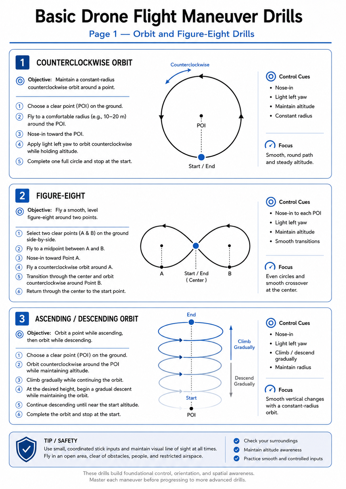
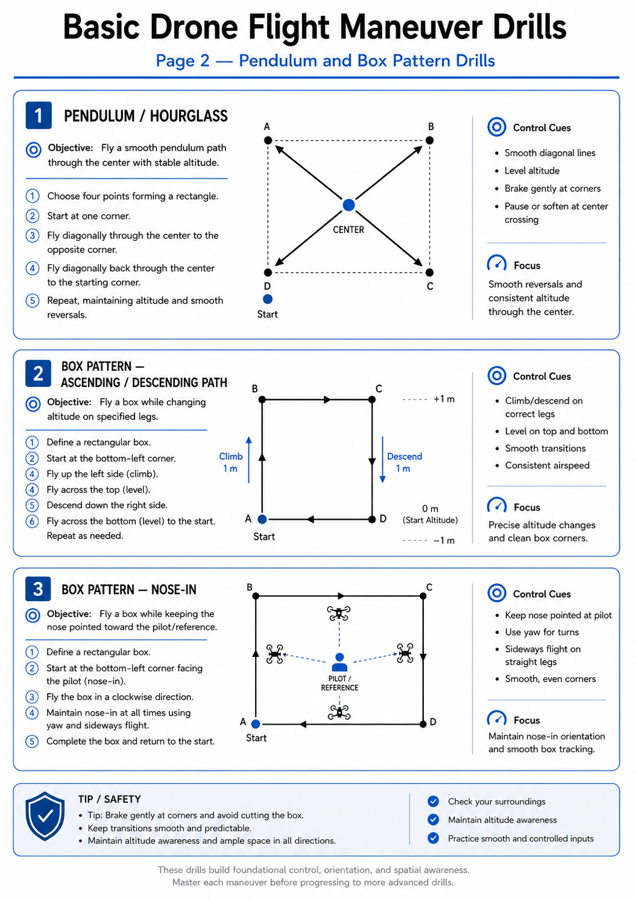
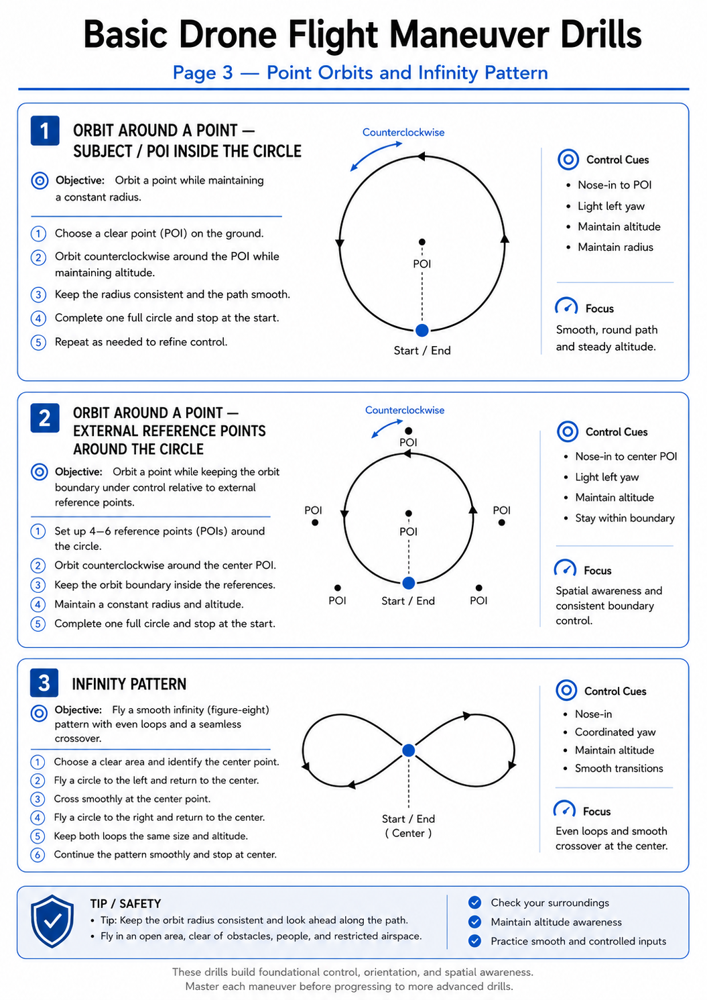
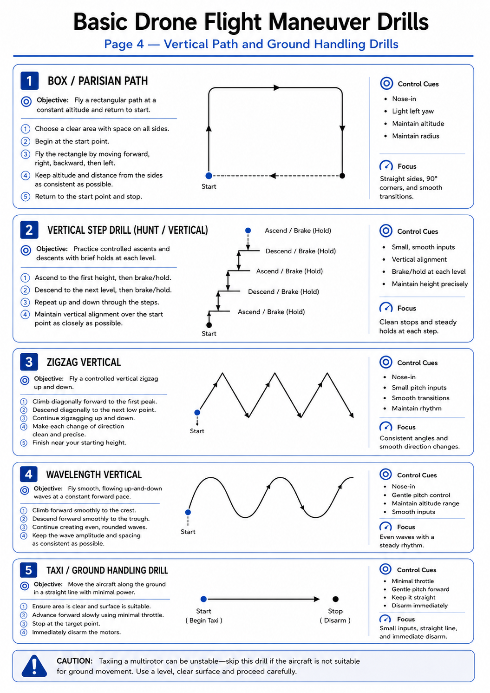

# Basic Drone Flight Maneuver Drills

A structured set of visual-line-of-sight flight exercises for developing orientation awareness, smooth control, altitude discipline, and coordinated maneuvering.

> [!WARNING]
> Conduct these drills only in a legal, open, and controlled flying area. Maintain visual line of sight, keep clear of people and property, follow local aviation regulations, and use an instructor or safety observer during early practice.

> [!CAUTION]
> Stick directions vary with aircraft orientation, transmitter mode, and flight-controller configuration. Verify control response at low power before flight. Do not copy a yaw, roll, pitch, or throttle command unless it matches your aircraft and current heading.

---

## Training Assumptions

- Multirotor aircraft in a stabilized flight mode
- Normal control response confirmed before takeoff
- Low wind and good visibility
- Clearly marked flight box
- Conservative altitude appropriate to the site
- Sufficient battery reserve for landing
- One maneuver performed at a time

## Recommended Progression

```text
1. Hover and orientation checks
          ↓
2. Circular orbits
          ↓
3. Figure-eight patterns
          ↓
4. Box patterns
          ↓
5. Altitude-change patterns
          ↓
6. Combined precision drills
          ↓
7. Taxi or ground-handling drill
```

## Optimized Training Sheets

These clean visual sheets complement the written maneuver guide and are suitable for GitHub preview, printing, or classroom discussion.

- [Page 1 — Orbit and Figure-Eight Drills](#1-circular-orbit-drills)
- [Page 2 — Pendulum and Box Pattern Drills](#4-pendulum-or-hourglass-drill)
- [Page 3 — Point Orbits and Infinity Pattern](#7-counterclockwise-and-clockwise-orbits-around-a-point)
- [Page 4 — Vertical Path and Ground Handling Drills](#9-box-pattern-nose-in-passing-path)

---

# 1. Circular Orbit Drills



## 1.1 Counterclockwise Orbit

**Objective:** Maintain a constant radius, altitude, speed, and nose orientation while completing a full circle.

### Procedure

1. Establish a stable hover at the designated start point.
2. Set the required nose orientation.
3. Begin a slow counterclockwise orbit.
4. Use small, coordinated yaw and lateral inputs.
5. Maintain altitude with gentle throttle corrections.
6. Complete one full circle.
7. Decelerate smoothly and stop at the start point.

### Performance Standard

- Circular path remains consistent.
- Altitude variation is minimal.
- Speed remains controlled.
- Aircraft stops without overshoot.

## 1.2 Clockwise Orbit

Repeat the same procedure in the opposite direction.

> [!NOTE]
> Train both directions equally. Pilots often become more comfortable turning in one direction, which can create an avoidable control bias.

---

# 2. Figure-Eight Drill


**Objective:** Practice coordinated direction changes while maintaining altitude and crossing the center point predictably.

### Procedure

1. Begin at the center or designated start point.
2. Enter the first circular turn.
3. Complete the first loop.
4. Cross the center smoothly.
5. Reverse the turn direction.
6. Complete the second loop.
7. Return to the start point and stop.

### Key Technique

- Look ahead along the intended path.
- Begin the direction change before reaching the center.
- Avoid abrupt yaw or roll corrections.
- Keep both loops similar in size.

---

# 3. Ascending and Descending Orbit


**Objective:** Combine circular flight with controlled altitude changes.

### Procedure

1. Start at the lower reference altitude.
2. Enter a stable orbit.
3. Climb gradually while maintaining the orbit.
4. Stop the climb at the upper reference altitude.
5. Continue the orbit briefly.
6. Descend gradually while maintaining the same radius.
7. Stop at the lower reference altitude.
8. Return to the start point.

> [!WARNING]
> Do not descend rapidly while using excessive horizontal speed. Maintain enough thrust margin to arrest the descent safely.

---

# 4. Pendulum or Hourglass Drill



**Objective:** Practice repeated diagonal transitions through a central reference point.

### Procedure

1. Start at the center.
2. Fly diagonally toward the first corner.
3. Decelerate before reaching the boundary.
4. Reverse direction and pass through the center.
5. Continue toward the opposite corner.
6. Repeat for the remaining diagonal pair.
7. Finish at the center and stop.

### Instructor Emphasis

- Smooth braking before each reversal
- Accurate passage through the center
- Equal path lengths
- Stable altitude throughout the maneuver

---

# 5. Box Pattern: Ascending and Descending Path


**Objective:** Maintain straight flight segments and precise corner control while changing altitude.

### Procedure

1. Start at the lower reference altitude.
2. Fly the first side of the box.
3. Turn at the corner using coordinated yaw and lateral input.
4. Climb gradually on the assigned side.
5. Continue around the box.
6. Descend gradually on the assigned side.
7. Return to the starting altitude and position.
8. Brake and stop.

### Common Errors

- Cutting corners
- Climbing during turns instead of straight segments
- Uneven side lengths
- Excessive speed near the boundary

---

# 6. Box Pattern: Nose-In


**Objective:** Fly a rectangular path while maintaining a nose-in orientation toward the pilot or center reference.

### Procedure

1. Establish a stable nose-in hover.
2. Move laterally along the first side.
3. Use coordinated yaw and lateral control to maintain the required nose orientation.
4. Complete each corner with small corrections.
5. Return to the starting point.
6. Stop and stabilize.

> [!CAUTION]
> Nose-in flight reverses the pilot’s visual left-right relationship. Practice at low speed and generous distance before reducing the size of the box.

---

# 7. Counterclockwise and Clockwise Orbits Around a Point



## 7.1 Orbit With Reference Point Inside the Circle

**Objective:** Maintain a constant distance from a fixed point while orbiting.

### Procedure

1. Select a visible reference point.
2. Position the aircraft at the assigned radius.
3. Begin the orbit slowly.
4. Keep the reference point at a constant relative position.
5. Maintain altitude and speed.
6. Complete one full orbit.
7. Stop at the starting point.

## 7.2 Orbit With Reference Points Outside the Circle

This variation uses several external markers to improve spatial awareness and boundary control.

### Training Focus

- Consistent radius
- Smooth heading changes
- Awareness of external boundaries
- Accurate return to the start point

---

# 8. Infinity Pattern


**Objective:** Combine two opposing loops into a continuous, smooth path.

### Procedure

1. Start at the center crossing point.
2. Fly the first loop.
3. Pass through the center.
4. Reverse the turn direction.
5. Fly the second loop.
6. Continue for the assigned number of cycles.
7. Return to the center and stop.

### Performance Standard

- The center crossing remains consistent.
- Both loops are similar in size.
- Altitude and speed remain stable.
- Direction changes are smooth.

---

# 9. Box Pattern: Nose-In Passing Path



**Objective:** Maintain a nose-in orientation while following the perimeter of a box.

### Procedure

1. Begin at a marked corner or midpoint.
2. Fly along the perimeter at low speed.
3. Keep the nose directed toward the assigned reference.
4. Pause or brake briefly at each corner.
5. Continue until the full perimeter is completed.
6. Return to the start point and stop.

---

# 10. Hunt or Vertical Step Drill


**Objective:** Practice repeated vertical climbs, descents, braking, and hover stabilization.

### Procedure

1. Start in a stable hover.
2. Climb to the upper reference altitude.
3. Stop and stabilize.
4. Descend to the lower reference altitude.
5. Stop and stabilize.
6. Repeat for the assigned number of cycles.
7. Finish at the lower reference altitude.

> [!WARNING]
> Keep the maneuver inside a safe altitude window. Avoid aggressive descents, especially with heavy aircraft or in turbulent air.

---

# 11. Vertical Zigzag


**Objective:** Combine forward movement with repeated, controlled climbs and descents.

### Procedure

1. Begin at the first waypoint.
2. Fly forward while climbing gradually.
3. Reverse the vertical trend at the peak.
4. Continue forward while descending.
5. Repeat the pattern.
6. Stop at the final waypoint.

### Key Technique

- Keep forward speed constant.
- Use smooth throttle transitions.
- Avoid pausing at each peak unless instructed.
- Maintain the assigned lateral track.

---

# 12. Vertical Wavelength Pattern


**Objective:** Fly a smooth wave-like vertical profile without abrupt altitude changes.

### Procedure

1. Start at the lower reference point.
2. Fly forward and climb smoothly.
3. Round the crest without stopping.
4. Descend smoothly into the trough.
5. Repeat the wave pattern.
6. Finish at the assigned endpoint.

### Difference From the Zigzag

| Zigzag | Wavelength |
|---|---|
| Defined peaks and direction changes | Rounded, continuous transitions |
| More deliberate control changes | Smoother throttle blending |
| Useful for braking practice | Useful for fluid altitude control |

---

# 13. Taxi or Ground-Handling Drill


**Objective:** Practice controlled low-power ground movement where the aircraft and site permit it.

### Procedure

1. Confirm the propeller area is clear.
2. Arm only when instructed.
3. Apply the minimum power needed to begin movement.
4. Move forward along the marked line.
5. Stop at the endpoint.
6. Reverse or reposition only when safe.
7. Disarm immediately after completion.

> [!WARNING]
> Taxiing a multirotor can be unstable and may cause a tip-over or propeller strike. Skip this exercise if the aircraft is not designed for ground movement.

---

# Safety Checklist

## Before Flight

- [ ] Airframe, propellers, and fasteners inspected
- [ ] Battery secured and voltage checked
- [ ] Control directions verified
- [ ] Flight mode confirmed
- [ ] Failsafe configured
- [ ] Flight area and boundaries established
- [ ] People kept outside the operating area
- [ ] Wind and weather acceptable
- [ ] Emergency landing area identified

## During Flight

- [ ] Maintain visual line of sight
- [ ] Use small control inputs
- [ ] Keep a safe distance from boundaries
- [ ] Monitor battery condition
- [ ] Stop the maneuver if orientation is lost
- [ ] Land immediately for abnormal vibration, sound, or control response

## After Flight

- [ ] Disarm before approaching
- [ ] Disconnect the battery
- [ ] Check motor and ESC temperature
- [ ] Inspect for damage or loose hardware
- [ ] Record training observations

---

# Emergency Recovery

When control or orientation becomes uncertain:

1. Release excessive stick input.
2. Stabilize the aircraft in the safest available mode.
3. Reduce horizontal speed.
4. Climb only when necessary to clear obstacles.
5. Re-establish orientation.
6. Land in the nearest safe area.

> [!IMPORTANT]
> Do not continue a maneuver merely to complete it. Safe recovery and landing take priority over the exercise.

---

# Suggested Scoring Rubric

| Criterion | Excellent | Acceptable | Needs Improvement |
|---|---|---|---|
| Path accuracy | Consistent and symmetrical | Minor deviations | Frequent large deviations |
| Altitude control | Nearly constant | Small corrections required | Repeated large changes |
| Speed control | Smooth and uniform | Some uneven sections | Abrupt or excessive speed |
| Orientation | Maintained throughout | Brief corrections | Repeated loss of orientation |
| Braking and stop | Precise and stable | Minor overshoot | Large overshoot or instability |
| Safety discipline | Fully compliant | One minor reminder | Repeated unsafe actions |

---

# Source and Visual Notes

The original diagrams were transcribed and reorganized from handwritten training sheets. The included infographic pages are optimized teaching visuals derived from those sheets for easier reading, GitHub presentation, and classroom use. Directional stick commands were generalized where necessary because exact control inputs depend on aircraft orientation, transmitter mode, and configuration.
